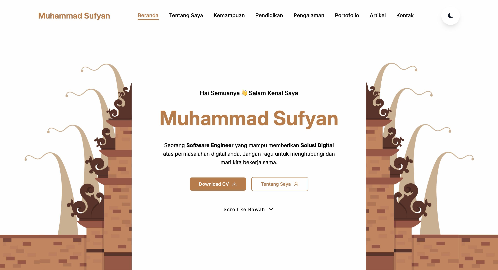

# Balinese Cultural Personal Portfolio



🌐 **Live Demo**  
https://balinese-cultural-personal-portfoli.vercel.app/

---

## 1️⃣ Tentang Website

**Balinese Cultural Personal Portfolio** adalah website portofolio pribadi yang dirancang untuk menampilkan profil profesional saya sebagai **Software Engineer**. Website ini mengusung konsep desain modern yang dipadukan dengan elemen visual dan filosofi budaya Bali sebagai identitas utama.

Website ini berfungsi sebagai media personal branding untuk:

- Memperkenalkan diri secara profesional
- Menampilkan kemampuan dan pengalaman
- Mempresentasikan proyek dan karya
- Menjadi sarana komunikasi dan kolaborasi

Pendekatan desain yang digunakan menekankan keseimbangan antara estetika budaya lokal dan kebutuhan teknologi modern.

---

## 2️⃣ Section pada Website

Website ini terdiri dari beberapa section utama berikut:

### 🔹 Beranda (Home)

Menampilkan perkenalan singkat, nama, profesi, serta tombol aksi seperti **Download CV** dan navigasi ke halaman lainnya.

### 🔹 Tentang Saya (About Me)

Berisi deskripsi latar belakang, minat, serta gambaran singkat perjalanan saya di bidang pengembangan perangkat lunak.

### 🔹 Kemampuan (Skills)

Menampilkan daftar kemampuan teknis, tools, dan teknologi yang dikuasai, baik frontend maupun backend.

### 🔹 Pendidikan (Education)

Berisi informasi riwayat pendidikan formal yang telah ditempuh.

### 🔹 Pengalaman (Experience)

Menjelaskan pengalaman kerja, magang, maupun proyek yang pernah dikerjakan.

### 🔹 Portofolio (Portfolio)

Kumpulan proyek yang pernah dibuat lengkap dengan deskripsi singkat dan visual pendukung.

### 🔹 Artikel (Articles)

Berisi artikel atau tulisan seputar pemrograman, teknologi, dan pengembangan perangkat lunak.

### 🔹 Kontak (Contact)

Form kontak yang memungkinkan pengunjung mengirim pesan langsung melalui email menggunakan EmailJS.

---

## 3️⃣ Cara Clone Project

Ikuti langkah-langkah berikut untuk menjalankan project ini secara lokal.

### Step 1: Clone Repository

```bash
git clone https://github.com/Muhammad-Sufyan-901/balinese-cultural-personal-portfolio.git
```

### Step 2: Masuk ke Folder Project

```bash
cd balinese-cultural-personal-portfolio
```

### Step 3: Install Dependencies

```bash
npm install
```

### Step 4: Jalankan Project

```bash
npm run dev
```

Aplikasi akan berjalan di:

```bash
http://localhost:5173
```

## 4️⃣ Environment Variables

Project ini menggunakan EmailJS untuk fitur pengiriman pesan pada halaman kontak.

Buat file `.env` di root project, lalu tambahkan konfigurasi berikut:

```bash
VITE_PUBLIC_EMAIL_JS_SERVICE_ID=YOUR_SERVICE_ID_FROM_EMAIL_JS
VITE_PUBLIC_EMAIL_JS_TEMPLATE_ID=YOUR_TEMPLATE_ID_FROM_EMAIL_JS
VITE_PUBLIC_EMAIL_JS_PUBLIC_KEY=YOUR_PUBLIC_KEY_FROM_EMAIL_JS
VITE_PUBLIC_BASE_URL=http://localhost:3000/
```

### Keterangan

- **VITE_PUBLIC_EMAIL_JS_SERVICE_ID** = ID service dari EmailJS
- **VITE_PUBLIC_EMAIL_JS_TEMPLATE_ID** = ID template email EmailJS
- **VITE_PUBLIC_EMAIL_JS_PUBLIC_KEY** = Public key EmailJS
- **VITE_PUBLIC_BASE_URL** = Base URL aplikasi yang digunakan

## 📄 Lisensi

Website ini dibuat sebagai portofolio pribadi yang open source.
Silakan digunakan dengan mencantumkan kredit jika diperlukan.

✨ **Terima kasih telah mengunjungi portofolio saya.**
